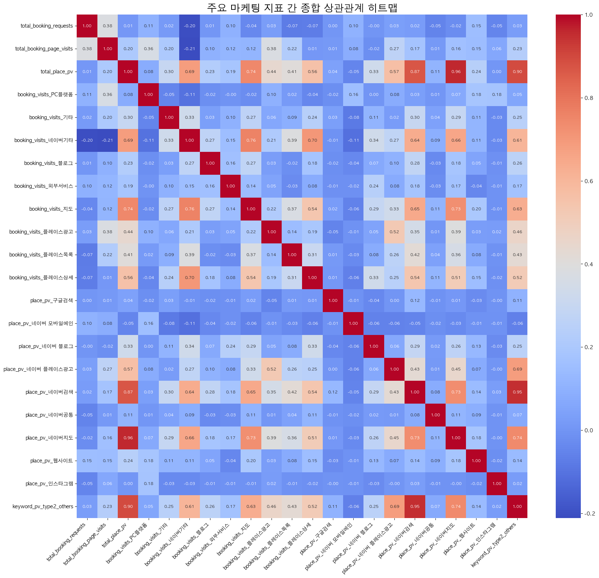

# NATENCLINIC 마케팅 퍼널 상관관계 분석 리포트

## 분석 요약

- **예약 퍼널의 기본 작동 확인**: `예약 페이지 방문수`와 `예약 신청 수`는 0.59의 뚜렷한 양의 상관관계를 보여, 예약 페이지 방문이 늘면 실제 예약도 증가하는 기본적인 퍼널이 작동함을 확인했습니다.
- **트래픽의 핵심 동력**: `플레이스 페이지 총 조회수`는 **'네이버 검색'** 유입(0.99) 및 **'브랜드성 키워드'**('아침', '285' 포함) 유입(0.94)과 매우 강한 상관관계를 보입니다. 이는 현재 트래픽이 대부분 병원 이름을 아는 사용자의 직접 검색에서 발생함을 의미합니다.
- **가장 중요한 발견 (트래픽의 양 vs 질)**: `플레이스 페이지 총 조회수`와 최종 `예약 신청 수`의 상관관계는 **0.05로 매우 낮습니다**. 이는 단순히 전체 방문자 수를 늘리는 것만으로는 예약 전환에 큰 영향을 주지 못하며, **트래픽의 질이 훨씬 중요함**을 시사합니다.
- **실제 예약에 효과적인 채널**: 최종 `예약 신청 수`와 가장 유의미한 상관관계를 보인 채널은 **'지도'(0.32)**와 **'플레이스목록'(0.31)**으로 나타났습니다. 이 채널을 통한 방문자의 예약 전환 가능성이 더 높습니다.

## 종합 상관관계 히트맵

## 상관관계가 높은 지표 Top 20

| feature1                | feature2                |   correlation |   abs_correlation |
|:------------------------|:------------------------|--------------:|------------------:|
| place_pv_네이버지도          | total_place_pv          |      0.958308 |          0.958308 |
| place_pv_네이버검색          | keyword_pv_type2_others |      0.949406 |          0.949406 |
| keyword_pv_type2_others | total_place_pv          |      0.895531 |          0.895531 |
| place_pv_네이버검색          | total_place_pv          |      0.870995 |          0.870995 |
| booking_visits_지도       | booking_visits_네이버기타    |      0.761962 |          0.761962 |
| booking_visits_지도       | total_place_pv          |      0.74496  |          0.74496  |
| keyword_pv_type2_others | place_pv_네이버지도          |      0.743855 |          0.743855 |
| place_pv_네이버검색          | place_pv_네이버지도          |      0.733933 |          0.733933 |
| place_pv_네이버지도          | booking_visits_지도       |      0.72848  |          0.72848  |
| booking_visits_플레이스상세   | booking_visits_네이버기타    |      0.702181 |          0.702181 |
| keyword_pv_type2_others | place_pv_네이버 플레이스광고     |      0.687765 |          0.687765 |
| total_place_pv          | booking_visits_네이버기타    |      0.685341 |          0.685341 |
| booking_visits_네이버기타    | place_pv_네이버지도          |      0.657858 |          0.657858 |
| place_pv_네이버검색          | booking_visits_지도       |      0.646544 |          0.646544 |
| place_pv_네이버검색          | booking_visits_네이버기타    |      0.636835 |          0.636835 |
| keyword_pv_type2_others | booking_visits_지도       |      0.634425 |          0.634425 |
| booking_visits_네이버기타    | keyword_pv_type2_others |      0.605538 |          0.605538 |
| place_pv_네이버 플레이스광고     | total_place_pv          |      0.568681 |          0.568681 |
| booking_visits_플레이스상세   | total_place_pv          |      0.55965  |          0.55965  |
| booking_visits_지도       | booking_visits_플레이스상세   |      0.540071 |          0.540071 |

## 전체 상관계수 행렬

|                           |   total_booking_requests |   total_booking_page_visits |   total_place_pv |   booking_visits_PC플랫폼 |   booking_visits_기타 |   booking_visits_네이버기타 |   booking_visits_블로그 |   booking_visits_외부서비스 |   booking_visits_지도 |   booking_visits_플레이스광고 |   booking_visits_플레이스목록 |   booking_visits_플레이스상세 |   place_pv_구글검색 |   place_pv_네이버 모바일메인 |   place_pv_네이버 블로그 |   place_pv_네이버 플레이스광고 |   place_pv_네이버검색 |   place_pv_네이버공통 |   place_pv_네이버지도 |   place_pv_웹사이트 |   place_pv_인스타그램 |   keyword_pv_type2_others |
|:--------------------------|-------------------------:|----------------------------:|-----------------:|-----------------------:|--------------------:|-----------------------:|---------------------:|-----------------------:|--------------------:|------------------------:|------------------------:|------------------------:|----------------:|---------------------:|-------------------:|----------------------:|-----------------:|-----------------:|-----------------:|----------------:|-----------------:|--------------------------:|
| total_booking_requests    |               1          |                  0.3814     |       0.0066738  |            0.105807    |           0.0161211 |            -0.202848   |           0.00572671 |              0.0986365 |          -0.0383805 |              0.0293349  |              -0.0749958 |             -0.0729544  |     0.00484333  |           0.103265   |       -0.00268072  |           0.0332895   |        0.0217323 |      -0.0528686  |      -0.0222834  |       0.14946   |     -0.0454499   |                 0.0289944 |
| total_booking_page_visits |               0.3814     |                  1          |       0.201806   |            0.363204    |           0.203833  |            -0.21098    |           0.0966004  |              0.119147  |           0.115138  |              0.380016   |               0.223079  |              0.00731562 |     0.0123262   |           0.0830561  |       -0.0201633   |           0.266282    |        0.172808  |       0.0129802  |       0.158731   |       0.146695  |      0.0630425   |                 0.230976  |
| total_place_pv            |               0.0066738  |                  0.201806   |       1          |            0.0796967   |           0.295722  |             0.685341   |           0.226242   |              0.185344  |           0.74496   |              0.437915   |               0.407591  |              0.55965    |     0.042987    |          -0.0479734  |        0.329515    |           0.568681    |        0.870995  |       0.110034   |       0.958308   |       0.239755  |      0.00381744  |                 0.895531  |
| booking_visits_PC플랫폼      |               0.105807   |                  0.363204   |       0.0796967  |            1           |          -0.0486695 |            -0.106542   |          -0.0215367  |             -0.003059  |          -0.0225614 |              0.0973759  |               0.0194851 |             -0.0422972  |    -0.0204468   |           0.156333   |        0.000711639 |           0.0786191   |        0.0335814 |       0.00521689 |       0.072562   |       0.182092  |      0.177256    |                 0.0541069 |
| booking_visits_기타         |               0.0161211  |                  0.203833   |       0.295722   |           -0.0486695   |           1         |             0.330671   |           0.0349051  |              0.099104  |           0.265037  |              0.0608152  |               0.0913199 |              0.241483   |     0.0309984   |          -0.0816686  |        0.106389    |           0.0234984   |        0.29607   |       0.0411406  |       0.290902   |       0.114723  |     -0.0313964   |                 0.245528  |
| booking_visits_네이버기타      |              -0.202848   |                 -0.21098    |       0.685341   |           -0.106542    |           0.330671  |             1          |           0.269737   |              0.152351  |           0.761962  |              0.214052   |               0.389118  |              0.702181   |    -0.00908285  |          -0.110641   |        0.335733    |           0.274548    |        0.636835  |       0.0895906  |       0.657858   |       0.114664  |     -0.0326499   |                 0.605538  |
| booking_visits_블로그        |               0.00572671 |                  0.0966004  |       0.226242   |           -0.0215367   |           0.0349051 |             0.269737   |           1          |              0.158251  |           0.272604  |              0.0298797  |              -0.018384  |              0.178173   |    -0.0193991   |          -0.0393859  |        0.0727687   |           0.103483    |        0.278173  |      -0.0329452  |       0.182127   |       0.0520523 |     -0.0137534   |                 0.258721  |
| booking_visits_외부서비스      |               0.0986365  |                  0.119147   |       0.185344   |           -0.003059    |           0.099104  |             0.152351   |           0.158251   |              1         |           0.144751  |              0.0461611  |              -0.0272337 |              0.0785998  |    -0.0149483   |          -0.0157348  |        0.241732    |           0.0753481   |        0.178771  |      -0.0253865  |       0.168993   |      -0.0411643 |     -0.0105979   |                 0.169328  |
| booking_visits_지도         |              -0.0383805  |                  0.115138   |       0.74496    |           -0.0225614   |           0.265037  |             0.761962   |           0.272604   |              0.144751  |           1         |              0.215045   |               0.3749    |              0.540071   |     0.0225316   |          -0.0583041  |        0.292946    |           0.334905    |        0.646544  |       0.109766   |       0.72848    |       0.20005   |     -0.0110889   |                 0.634425  |
| booking_visits_플레이스광고     |               0.0293349  |                  0.380016   |       0.437915   |            0.0973759   |           0.0608152 |             0.214052   |           0.0298797  |              0.0461611 |           0.215045  |              1          |               0.144075  |              0.191485   |    -0.0521168   |          -0.008882   |        0.0457543   |           0.524221    |        0.350252  |       0.00611467 |       0.391128   |       0.0281374 |      0.0236204   |                 0.462403  |
| booking_visits_플레이스목록     |              -0.0749958  |                  0.223079   |       0.407591   |            0.0194851   |           0.0913199 |             0.389118   |          -0.018384   |             -0.0272337 |           0.3749    |              0.144075   |               1         |              0.307369   |     0.0120205   |          -0.0332925  |        0.08076     |           0.258455    |        0.419498  |       0.0438813  |       0.35867    |       0.0759606 |     -0.0120165   |                 0.425913  |
| booking_visits_플레이스상세     |              -0.0729544  |                  0.00731562 |       0.55965    |           -0.0422972   |           0.241483  |             0.702181   |           0.178173   |              0.0785998 |           0.540071  |              0.191485   |               0.307369  |              1          |     0.0110902   |          -0.0604006  |        0.33361     |           0.24734     |        0.537147  |       0.113276   |       0.512311   |       0.150419  |     -0.0157086   |                 0.516314  |
| place_pv_구글검색             |               0.00484333 |                  0.0123262  |       0.042987   |           -0.0204468   |           0.0309984 |            -0.00908285 |          -0.0193991  |             -0.0149483 |           0.0225316 |             -0.0521168  |               0.0120205 |              0.0110902  |     1           |          -0.0121298  |       -0.0386974   |           0.000937643 |        0.12493   |      -0.0101463  |       0.00741262 |      -0.029924  |     -0.00423571  |                 0.105188  |
| place_pv_네이버 모바일메인        |               0.103265   |                  0.0830561  |      -0.0479734  |            0.156333    |          -0.0816686 |            -0.110641   |          -0.0393859  |             -0.0157348 |          -0.0583041 |             -0.008882   |              -0.0332925 |             -0.0604006  |    -0.0121298   |           1          |       -0.0576236   |          -0.0561315   |       -0.0545019 |      -0.0205999  |      -0.0341754  |      -0.0101819 |     -0.00859974  |                -0.0632163 |
| place_pv_네이버 블로그          |              -0.00268072 |                 -0.0201633  |       0.329515   |            0.000711639 |           0.106389  |             0.335733   |           0.0727687  |              0.241732  |           0.292946  |              0.0457543  |               0.08076   |              0.33361    |    -0.0386974   |          -0.0576236  |        1           |           0.0644979   |        0.287891  |       0.018926   |       0.26294    |       0.126888  |     -0.0274354   |                 0.252879  |
| place_pv_네이버 플레이스광고       |               0.0332895  |                  0.266282   |       0.568681   |            0.0786191   |           0.0234984 |             0.274548   |           0.103483   |              0.0753481 |           0.334905  |              0.524221   |               0.258455  |              0.24734    |     0.000937643 |          -0.0561315  |        0.0644979   |           1           |        0.425027  |       0.0140066  |       0.448618   |       0.0739229 |     -0.000137372 |                 0.687765  |
| place_pv_네이버검색            |               0.0217323  |                  0.172808   |       0.870995   |            0.0335814   |           0.29607   |             0.636835   |           0.278173   |              0.178771  |           0.646544  |              0.350252   |               0.419498  |              0.537147   |     0.12493     |          -0.0545019  |        0.287891    |           0.425027    |        1         |       0.0817801  |       0.733933   |       0.139633  |      0.0273242   |                 0.949406  |
| place_pv_네이버공통            |              -0.0528686  |                  0.0129802  |       0.110034   |            0.00521689  |           0.0411406 |             0.0895906  |          -0.0329452  |             -0.0253865 |           0.109766  |              0.00611467 |               0.0438813 |              0.113276   |    -0.0101463   |          -0.0205999  |        0.018926    |           0.0140066   |        0.0817801 |       1          |       0.111236   |       0.0908145 |     -0.00719344  |                 0.0703401 |
| place_pv_네이버지도            |              -0.0222834  |                  0.158731   |       0.958308   |            0.072562    |           0.290902  |             0.657858   |           0.182127   |              0.168993  |           0.72848   |              0.391128   |               0.35867   |              0.512311   |     0.00741262  |          -0.0341754  |        0.26294     |           0.448618    |        0.733933  |       0.111236   |       1          |       0.182126  |     -0.00489614  |                 0.743855  |
| place_pv_웹사이트             |               0.14946    |                  0.146695   |       0.239755   |            0.182092    |           0.114723  |             0.114664   |           0.0520523  |             -0.0411643 |           0.20005   |              0.0281374  |               0.0759606 |              0.150419   |    -0.029924    |          -0.0101819  |        0.126888    |           0.0739229   |        0.139633  |       0.0908145  |       0.182126   |       1         |     -0.0212153   |                 0.137403  |
| place_pv_인스타그램            |              -0.0454499  |                  0.0630425  |       0.00381744 |            0.177256    |          -0.0313964 |            -0.0326499  |          -0.0137534  |             -0.0105979 |          -0.0110889 |              0.0236204  |              -0.0120165 |             -0.0157086  |    -0.00423571  |          -0.00859974 |       -0.0274354   |          -0.000137372 |        0.0273242 |      -0.00719344 |      -0.00489614 |      -0.0212153 |      1           |                 0.0218252 |
| keyword_pv_type2_others   |               0.0289944  |                  0.230976   |       0.895531   |            0.0541069   |           0.245528  |             0.605538   |           0.258721   |              0.169328  |           0.634425  |              0.462403   |               0.425913  |              0.516314   |     0.105188    |          -0.0632163  |        0.252879    |           0.687765    |        0.949406  |       0.0703401  |       0.743855   |       0.137403  |      0.0218252   |                 1         |

