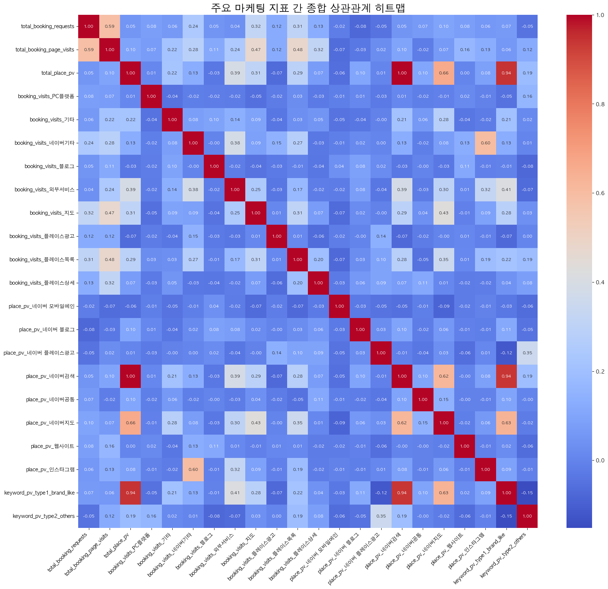

# GOODMORNINGHANIGURO 마케팅 퍼널 상관관계 분석 리포트

## 분석 요약

- **예약 퍼널의 기본 작동 확인**: `예약 페이지 방문수`와 `예약 신청 수`는 0.59의 뚜렷한 양의 상관관계를 보여, 예약 페이지 방문이 늘면 실제 예약도 증가하는 기본적인 퍼널이 작동함을 확인했습니다.
- **트래픽의 핵심 동력**: `플레이스 페이지 총 조회수`는 **'네이버 검색'** 유입(0.99) 및 **'브랜드성 키워드'**('아침', '285' 포함) 유입(0.94)과 매우 강한 상관관계를 보입니다. 이는 현재 트래픽이 대부분 병원 이름을 아는 사용자의 직접 검색에서 발생함을 의미합니다.
- **가장 중요한 발견 (트래픽의 양 vs 질)**: `플레이스 페이지 총 조회수`와 최종 `예약 신청 수`의 상관관계는 **0.05로 매우 낮습니다**. 이는 단순히 전체 방문자 수를 늘리는 것만으로는 예약 전환에 큰 영향을 주지 못하며, **트래픽의 질이 훨씬 중요함**을 시사합니다.
- **실제 예약에 효과적인 채널**: 최종 `예약 신청 수`와 가장 유의미한 상관관계를 보인 채널은 **'지도'(0.32)**와 **'플레이스목록'(0.31)**으로 나타났습니다. 이 채널을 통한 방문자의 예약 전환 가능성이 더 높습니다.

## 종합 상관관계 히트맵

## 상관관계가 높은 지표 Top 20

| feature1                    | feature2                    |   correlation |   abs_correlation |
|:----------------------------|:----------------------------|--------------:|------------------:|
| total_place_pv              | place_pv_네이버검색              |      0.998446 |          0.998446 |
| keyword_pv_type1_brand_like | total_place_pv              |      0.941737 |          0.941737 |
| keyword_pv_type1_brand_like | place_pv_네이버검색              |      0.941111 |          0.941111 |
| total_place_pv              | place_pv_네이버지도              |      0.661606 |          0.661606 |
| place_pv_네이버지도              | keyword_pv_type1_brand_like |      0.634326 |          0.634326 |
| place_pv_네이버지도              | place_pv_네이버검색              |      0.621083 |          0.621083 |
| place_pv_인스타그램              | booking_visits_네이버기타        |      0.597478 |          0.597478 |
| total_booking_page_visits   | total_booking_requests      |      0.587222 |          0.587222 |
| booking_visits_플레이스목록       | total_booking_page_visits   |      0.477266 |          0.477266 |
| booking_visits_지도           | total_booking_page_visits   |      0.472394 |          0.472394 |
| booking_visits_지도           | place_pv_네이버지도              |      0.431782 |          0.431782 |
| booking_visits_외부서비스        | keyword_pv_type1_brand_like |      0.413232 |          0.413232 |
| total_place_pv              | booking_visits_외부서비스        |      0.390507 |          0.390507 |
| place_pv_네이버검색              | booking_visits_외부서비스        |      0.387171 |          0.387171 |
| booking_visits_외부서비스        | booking_visits_네이버기타        |      0.379241 |          0.379241 |
| keyword_pv_type2_others     | place_pv_네이버 플레이스광고         |      0.350865 |          0.350865 |
| booking_visits_플레이스목록       | place_pv_네이버지도              |      0.349755 |          0.349755 |
| booking_visits_외부서비스        | place_pv_인스타그램              |      0.324817 |          0.324817 |
| total_booking_requests      | booking_visits_지도           |      0.319819 |          0.319819 |
| total_booking_page_visits   | booking_visits_플레이스상세       |      0.316151 |          0.316151 |

## 전체 상관계수 행렬

|                             |   total_booking_requests |   total_booking_page_visits |   total_place_pv |   booking_visits_PC플랫폼 |   booking_visits_기타 |   booking_visits_네이버기타 |   booking_visits_블로그 |   booking_visits_외부서비스 |   booking_visits_지도 |   booking_visits_플레이스광고 |   booking_visits_플레이스목록 |   booking_visits_플레이스상세 |   place_pv_네이버 모바일메인 |   place_pv_네이버 블로그 |   place_pv_네이버 플레이스광고 |   place_pv_네이버검색 |   place_pv_네이버공통 |   place_pv_네이버지도 |   place_pv_웹사이트 |   place_pv_인스타그램 |   keyword_pv_type1_brand_like |   keyword_pv_type2_others |
|:----------------------------|-------------------------:|----------------------------:|-----------------:|-----------------------:|--------------------:|-----------------------:|---------------------:|-----------------------:|--------------------:|------------------------:|------------------------:|------------------------:|---------------------:|-------------------:|----------------------:|-----------------:|-----------------:|-----------------:|----------------:|-----------------:|------------------------------:|--------------------------:|
| total_booking_requests      |                1         |                   0.587222  |       0.0524378  |             0.0801242  |          0.0631571  |             0.24121    |          0.0488348   |              0.0358723 |          0.319819   |              0.11983    |              0.306799   |              0.128344   |          -0.0198232  |        -0.0774502  |           -0.0455933  |       0.0487253  |      0.0665096   |       0.0988376  |      0.081254   |       0.0554171  |                    0.065234   |               -0.0480501  |
| total_booking_page_visits   |                0.587222  |                   1         |       0.0974668  |             0.0724847  |          0.215173   |             0.283637   |          0.11441     |              0.241076  |          0.472394   |              0.120951   |              0.477266   |              0.316151   |          -0.0660392  |        -0.03113    |            0.0239442  |       0.0959859  |     -0.0193044   |       0.0685817  |      0.164185   |       0.130253   |                    0.0557327  |                0.118381   |
| total_place_pv              |                0.0524378 |                   0.0974668 |       1          |             0.00645414 |          0.22038    |             0.129341   |         -0.0331424   |              0.390507  |          0.306671   |             -0.0668225  |              0.292184   |              0.0691929  |          -0.0584603  |         0.104636   |            0.00554539 |       0.998446   |      0.101488    |       0.661606   |      0.00223691 |       0.0836471  |                    0.941737   |                0.185687   |
| booking_visits_PC플랫폼        |                0.0801242 |                   0.0724847 |       0.00645414 |             1          |         -0.0447     |            -0.0159174  |         -0.0190085   |             -0.0242409 |         -0.0536333  |             -0.0218385  |              0.0263589  |             -0.0283818  |          -0.0138983  |         0.00609212 |           -0.0258468  |       0.00771148 |     -0.0158407   |      -0.0103782  |      0.0175862  |      -0.00677155 |                   -0.0493556  |                0.162236   |
| booking_visits_기타           |                0.0631571 |                   0.215173  |       0.22038    |            -0.0447     |          1          |             0.0813369  |          0.095599    |              0.14002   |          0.0935947  |             -0.0359941  |              0.0288342  |              0.0490994  |          -0.045543   |        -0.036074   |           -0.00412271 |       0.211606   |      0.0601864   |       0.278373   |     -0.0387085  |      -0.0221896  |                    0.206903   |                0.0182073  |
| booking_visits_네이버기타        |                0.24121   |                   0.283637  |       0.129341   |            -0.0159174  |          0.0813369  |             1          |         -0.00241014  |              0.379241  |          0.0863789  |              0.147829   |              0.272601   |             -0.0325524  |          -0.0144882  |         0.0181494  |            0.00476473 |       0.128761   |     -0.016513    |       0.0760941  |      0.128421   |       0.597478   |                    0.128105   |                0.00508896 |
| booking_visits_블로그          |                0.0488348 |                   0.11441   |      -0.0331424  |            -0.0190085  |          0.095599   |            -0.00241014 |          1           |             -0.0205157 |         -0.0444209  |             -0.0271863  |             -0.00628264 |             -0.0388739  |           0.0365794  |         0.0832166  |            0.0200354  |      -0.0339654  |     -0.000955084 |      -0.0344003  |      0.112379   |      -0.00842975 |                   -0.00613935 |               -0.0794883  |
| booking_visits_외부서비스        |                0.0358723 |                   0.241076  |       0.390507   |            -0.0242409  |          0.14002    |             0.379241   |         -0.0205157   |              1         |          0.247396   |             -0.0346699  |              0.172667   |             -0.0203621  |          -0.0220643  |         0.0756956  |           -0.0378386  |       0.387171   |     -0.025148    |       0.300241   |      0.0111585  |       0.324817   |                    0.413232   |               -0.0671332  |
| booking_visits_지도           |                0.319819  |                   0.472394  |       0.306671   |            -0.0536333  |          0.0935947  |             0.0863789  |         -0.0444209   |              0.247396  |          1          |              0.00960973 |              0.306572   |              0.0703677  |          -0.0665715  |         0.020304   |           -0.00411949 |       0.290452   |      0.0353454   |       0.431782   |     -0.00949284 |       0.0880363  |                    0.281166   |                0.033147   |
| booking_visits_플레이스광고       |                0.11983   |                   0.120951  |      -0.0668225  |            -0.0218385  |         -0.0359941  |             0.147829   |         -0.0271863   |             -0.0346699 |          0.00960973 |              1          |              0.0132046  |             -0.0616447  |          -0.0198775  |        -0.00287198 |            0.136565   |      -0.0718117  |     -0.0226556   |      -0.00201449 |      0.00913767 |      -0.00968479 |                   -0.0719165  |                0.00455891 |
| booking_visits_플레이스목록       |                0.306799  |                   0.477266  |       0.292184   |             0.0263589  |          0.0288342  |             0.272601   |         -0.00628264  |              0.172667  |          0.306572   |              0.0132046  |              1          |              0.197613   |          -0.0741631  |         0.0279119  |            0.0954441  |       0.27935    |     -0.0512041   |       0.349755   |      0.0104571  |       0.190115   |                    0.217002   |                0.188942   |
| booking_visits_플레이스상세       |                0.128344  |                   0.316151  |       0.0691929  |            -0.0283818  |          0.0490994  |            -0.0325524  |         -0.0388739   |             -0.0203621 |          0.0703677  |             -0.0616447  |              0.197613   |              1          |          -0.0297684  |         0.0565106  |            0.0937115  |       0.0700205  |      0.109427    |       0.00789801 |     -0.022642   |      -0.0196165  |                    0.0435916  |                0.0812772  |
| place_pv_네이버 모바일메인          |               -0.0198232 |                  -0.0660392 |      -0.0584603  |            -0.0138983  |         -0.045543   |            -0.0144882  |          0.0365794   |             -0.0220643 |         -0.0665715  |             -0.0198775  |             -0.0741631  |             -0.0297684  |           1          |        -0.0291507  |           -0.0453335  |      -0.0542474  |     -0.0144183   |      -0.0851578  |     -0.0219305  |      -0.00616351 |                   -0.0337154  |               -0.0619453  |
| place_pv_네이버 블로그            |               -0.0774502 |                  -0.03113   |       0.104636   |             0.00609212 |         -0.036074   |             0.0181494  |          0.0832166   |              0.0756956 |          0.020304   |             -0.00287198 |              0.0279119  |              0.0565106  |          -0.0291507  |         1          |            0.0282321  |       0.0966533  |     -0.0189886   |       0.0570621  |     -0.0113734  |      -0.0142029  |                    0.11403    |               -0.0462067  |
| place_pv_네이버 플레이스광고         |               -0.0455933 |                   0.0239442 |       0.00554539 |            -0.0258468  |         -0.00412271 |             0.00476473 |          0.0200354   |             -0.0378386 |         -0.00411949 |              0.136565   |              0.0954441  |              0.0937115  |          -0.0453335  |         0.0282321  |            1          |      -0.0113271  |     -0.03899     |       0.0314744  |     -0.0580954  |       0.00718106 |                   -0.118928   |                0.350865   |
| place_pv_네이버검색              |                0.0487253 |                   0.0959859 |       0.998446   |             0.00771148 |          0.211606   |             0.128761   |         -0.0339654   |              0.387171  |          0.290452   |             -0.0718117  |              0.27935    |              0.0700205  |          -0.0542474  |         0.0966533  |           -0.0113271  |       1          |      0.0962185   |       0.621083   |     -0.00180843 |       0.0828664  |                    0.941111   |                0.191225   |
| place_pv_네이버공통              |                0.0665096 |                  -0.0193044 |       0.101488   |            -0.0158407  |          0.0601864  |            -0.016513   |         -0.000955084 |             -0.025148  |          0.0353454  |             -0.0226556  |             -0.0512041  |              0.109427   |          -0.0144183  |        -0.0189886  |           -0.03899    |       0.0962185  |      1           |       0.147345   |     -0.0041136  |      -0.00702491 |                    0.0972651  |               -0.00244245 |
| place_pv_네이버지도              |                0.0988376 |                   0.0685817 |       0.661606   |            -0.0103782  |          0.278373   |             0.0760941  |         -0.0344003   |              0.300241  |          0.431782   |             -0.00201449 |              0.349755   |              0.00789801 |          -0.0851578  |         0.0570621  |            0.0314744  |       0.621083   |      0.147345    |       1          |     -0.0163545  |       0.0634773  |                    0.634326   |               -0.0220104  |
| place_pv_웹사이트               |                0.081254  |                   0.164185  |       0.00223691 |             0.0175862  |         -0.0387085  |             0.128421   |          0.112379    |              0.0111585 |         -0.00949284 |              0.00913767 |              0.0104571  |             -0.022642   |          -0.0219305  |        -0.0113734  |           -0.0580954  |      -0.00180843 |     -0.0041136   |      -0.0163545  |      1          |      -0.0114298  |                    0.0199133  |               -0.0646784  |
| place_pv_인스타그램              |                0.0554171 |                   0.130253  |       0.0836471  |            -0.00677155 |         -0.0221896  |             0.597478   |         -0.00842975  |              0.324817  |          0.0880363  |             -0.00968479 |              0.190115   |             -0.0196165  |          -0.00616351 |        -0.0142029  |            0.00718106 |       0.0828664  |     -0.00702491  |       0.0634773  |     -0.0114298  |       1          |                    0.0873065  |               -0.010451   |
| keyword_pv_type1_brand_like |                0.065234  |                   0.0557327 |       0.941737   |            -0.0493556  |          0.206903   |             0.128105   |         -0.00613935  |              0.413232  |          0.281166   |             -0.0719165  |              0.217002   |              0.0435916  |          -0.0337154  |         0.11403    |           -0.118928   |       0.941111   |      0.0972651   |       0.634326   |      0.0199133  |       0.0873065  |                    1          |               -0.151603   |
| keyword_pv_type2_others     |               -0.0480501 |                   0.118381  |       0.185687   |             0.162236   |          0.0182073  |             0.00508896 |         -0.0794883   |             -0.0671332 |          0.033147   |              0.00455891 |              0.188942   |              0.0812772  |          -0.0619453  |        -0.0462067  |            0.350865   |       0.191225   |     -0.00244245  |      -0.0220104  |     -0.0646784  |      -0.010451   |                   -0.151603   |                1          |

