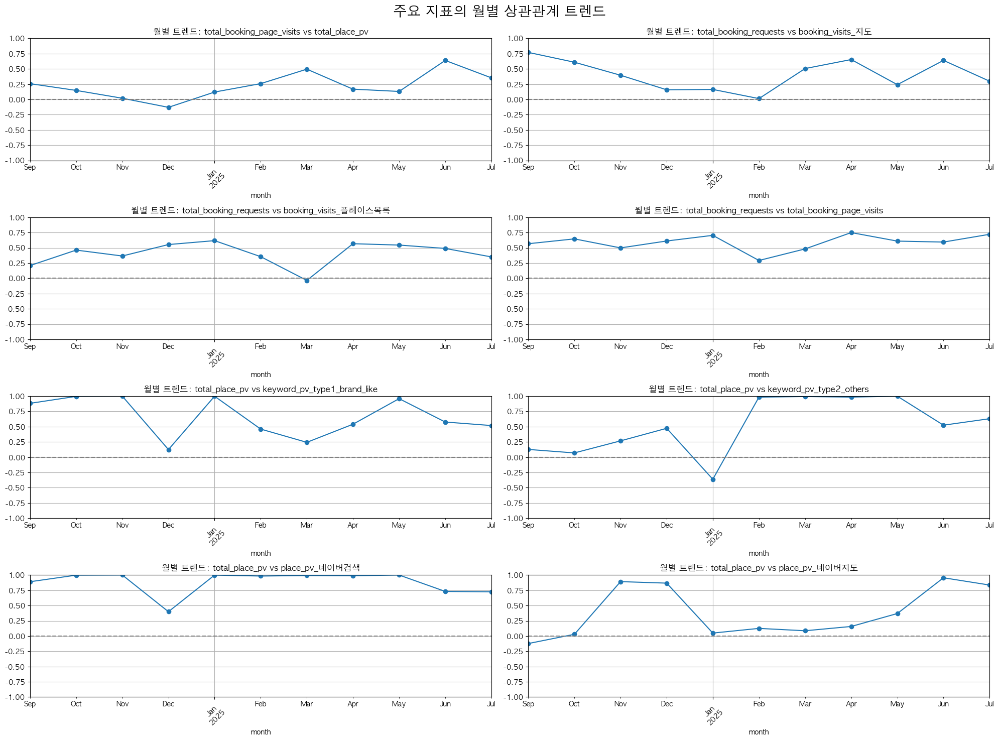

# GOODMORNINGHANIGURO 마케팅 퍼널 상관관계 분석 리포트

## 1. 전체 기간 주요 퍼널 단계별 상관관계

전체 분석 기간동안의 평균적인 관계입니다.

| category       | pair                                                |   correlation |
|:---------------|:----------------------------------------------------|--------------:|
| 1. 예약 전환 분석    | total_booking_requests vs total_booking_page_visits |     0.587222  |
| 1. 예약 전환 분석    | total_booking_requests vs booking_visits_지도         |     0.319819  |
| 1. 예약 전환 분석    | total_booking_requests vs booking_visits_플레이스목록     |     0.306799  |
| 1. 예약 전환 분석    | total_booking_page_visits vs total_place_pv         |     0.0974668 |
| 2. 플레이스 트래픽 분석 | total_place_pv vs place_pv_네이버검색                    |     0.998446  |
| 2. 플레이스 트래픽 분석 | total_place_pv vs place_pv_네이버지도                    |     0.661606  |
| 2. 플레이스 트래픽 분석 | total_place_pv vs keyword_pv_type1_brand_like       |     0.941737  |
| 2. 플레이스 트래픽 분석 | total_place_pv vs keyword_pv_type2_others           |     0.185687  |

## 2. 상관관계 안정성 분석 (변동성 낮은 순)

월별 상관관계의 표준편차입니다. 값이 낮을수록 기간에 상관없이 꾸준하고 안정적인 관계임을 의미합니다.

| pair                                                |   std_dev |
|:----------------------------------------------------|----------:|
| total_booking_requests vs total_booking_page_visits |  0.129934 |
| total_booking_requests vs booking_visits_플레이스목록     |  0.190133 |
| total_place_pv vs place_pv_네이버검색                    |  0.19203  |
| total_booking_page_visits vs total_place_pv         |  0.214517 |
| total_booking_requests vs booking_visits_지도         |  0.247623 |
| total_place_pv vs keyword_pv_type1_brand_like       |  0.319955 |
| total_place_pv vs place_pv_네이버지도                    |  0.415045 |
| total_place_pv vs keyword_pv_type2_others           |  0.458065 |

## 3. 월별 상관관계 트렌드

주요 관계들이 월별로 어떻게 변하는지 보여줍니다. 특정 마케팅 활동이나 이벤트와의 연관성을 파악하는 데 유용합니다.

## 4. 월별 상관관계 상세 데이터

| month   | category       | pair                                                |   correlation |
|:--------|:---------------|:----------------------------------------------------|--------------:|
| 2024-09 | 1. 예약 전환 분석    | total_booking_requests vs total_booking_page_visits |     0.566185  |
| 2024-09 | 1. 예약 전환 분석    | total_booking_requests vs booking_visits_지도         |     0.770515  |
| 2024-09 | 1. 예약 전환 분석    | total_booking_requests vs booking_visits_플레이스목록     |     0.208851  |
| 2024-09 | 1. 예약 전환 분석    | total_booking_page_visits vs total_place_pv         |     0.258052  |
| 2024-09 | 2. 플레이스 트래픽 분석 | total_place_pv vs place_pv_네이버검색                    |     0.889789  |
| 2024-09 | 2. 플레이스 트래픽 분석 | total_place_pv vs place_pv_네이버지도                    |    -0.122977  |
| 2024-09 | 2. 플레이스 트래픽 분석 | total_place_pv vs keyword_pv_type1_brand_like       |     0.882031  |
| 2024-09 | 2. 플레이스 트래픽 분석 | total_place_pv vs keyword_pv_type2_others           |     0.126624  |
| 2024-10 | 1. 예약 전환 분석    | total_booking_requests vs total_booking_page_visits |     0.645679  |
| 2024-10 | 1. 예약 전환 분석    | total_booking_requests vs booking_visits_지도         |     0.609197  |
| 2024-10 | 1. 예약 전환 분석    | total_booking_requests vs booking_visits_플레이스목록     |     0.462086  |
| 2024-10 | 1. 예약 전환 분석    | total_booking_page_visits vs total_place_pv         |     0.147273  |
| 2024-10 | 2. 플레이스 트래픽 분석 | total_place_pv vs place_pv_네이버검색                    |     0.997517  |
| 2024-10 | 2. 플레이스 트래픽 분석 | total_place_pv vs place_pv_네이버지도                    |     0.0287272 |
| 2024-10 | 2. 플레이스 트래픽 분석 | total_place_pv vs keyword_pv_type1_brand_like       |     0.996115  |
| 2024-10 | 2. 플레이스 트래픽 분석 | total_place_pv vs keyword_pv_type2_others           |     0.069512  |
| 2024-11 | 1. 예약 전환 분석    | total_booking_requests vs total_booking_page_visits |     0.497939  |
| 2024-11 | 1. 예약 전환 분석    | total_booking_requests vs booking_visits_지도         |     0.395755  |
| 2024-11 | 1. 예약 전환 분석    | total_booking_requests vs booking_visits_플레이스목록     |     0.365187  |
| 2024-11 | 1. 예약 전환 분석    | total_booking_page_visits vs total_place_pv         |     0.019173  |
| 2024-11 | 2. 플레이스 트래픽 분석 | total_place_pv vs place_pv_네이버검색                    |     0.999741  |
| 2024-11 | 2. 플레이스 트래픽 분석 | total_place_pv vs place_pv_네이버지도                    |     0.891487  |
| 2024-11 | 2. 플레이스 트래픽 분석 | total_place_pv vs keyword_pv_type1_brand_like       |     0.999671  |
| 2024-11 | 2. 플레이스 트래픽 분석 | total_place_pv vs keyword_pv_type2_others           |     0.267003  |
| 2024-12 | 1. 예약 전환 분석    | total_booking_requests vs total_booking_page_visits |     0.611073  |
| 2024-12 | 1. 예약 전환 분석    | total_booking_requests vs booking_visits_지도         |     0.157567  |
| 2024-12 | 1. 예약 전환 분석    | total_booking_requests vs booking_visits_플레이스목록     |     0.552736  |
| 2024-12 | 1. 예약 전환 분석    | total_booking_page_visits vs total_place_pv         |    -0.129796  |
| 2024-12 | 2. 플레이스 트래픽 분석 | total_place_pv vs place_pv_네이버검색                    |     0.39893   |
| 2024-12 | 2. 플레이스 트래픽 분석 | total_place_pv vs place_pv_네이버지도                    |     0.86667   |
| 2024-12 | 2. 플레이스 트래픽 분석 | total_place_pv vs keyword_pv_type1_brand_like       |     0.124334  |
| 2024-12 | 2. 플레이스 트래픽 분석 | total_place_pv vs keyword_pv_type2_others           |     0.47285   |
| 2025-01 | 1. 예약 전환 분석    | total_booking_requests vs total_booking_page_visits |     0.703584  |
| 2025-01 | 1. 예약 전환 분석    | total_booking_requests vs booking_visits_지도         |     0.163486  |
| 2025-01 | 1. 예약 전환 분석    | total_booking_requests vs booking_visits_플레이스목록     |     0.616833  |
| 2025-01 | 1. 예약 전환 분석    | total_booking_page_visits vs total_place_pv         |     0.120606  |
| 2025-01 | 2. 플레이스 트래픽 분석 | total_place_pv vs place_pv_네이버검색                    |     0.99824   |
| 2025-01 | 2. 플레이스 트래픽 분석 | total_place_pv vs place_pv_네이버지도                    |     0.0486775 |
| 2025-01 | 2. 플레이스 트래픽 분석 | total_place_pv vs keyword_pv_type1_brand_like       |     0.998068  |
| 2025-01 | 2. 플레이스 트래픽 분석 | total_place_pv vs keyword_pv_type2_others           |    -0.362053  |
| 2025-02 | 1. 예약 전환 분석    | total_booking_requests vs total_booking_page_visits |     0.291893  |
| 2025-02 | 1. 예약 전환 분석    | total_booking_requests vs booking_visits_지도         |     0.0133265 |
| 2025-02 | 1. 예약 전환 분석    | total_booking_requests vs booking_visits_플레이스목록     |     0.354278  |
| 2025-02 | 1. 예약 전환 분석    | total_booking_page_visits vs total_place_pv         |     0.258722  |
| 2025-02 | 2. 플레이스 트래픽 분석 | total_place_pv vs place_pv_네이버검색                    |     0.982758  |
| 2025-02 | 2. 플레이스 트래픽 분석 | total_place_pv vs place_pv_네이버지도                    |     0.125392  |
| 2025-02 | 2. 플레이스 트래픽 분석 | total_place_pv vs keyword_pv_type1_brand_like       |     0.460026  |
| 2025-02 | 2. 플레이스 트래픽 분석 | total_place_pv vs keyword_pv_type2_others           |     0.983878  |
| 2025-03 | 1. 예약 전환 분석    | total_booking_requests vs total_booking_page_visits |     0.481249  |
| 2025-03 | 1. 예약 전환 분석    | total_booking_requests vs booking_visits_지도         |     0.505345  |
| 2025-03 | 1. 예약 전환 분석    | total_booking_requests vs booking_visits_플레이스목록     |    -0.0347816 |
| 2025-03 | 1. 예약 전환 분석    | total_booking_page_visits vs total_place_pv         |     0.495484  |
| 2025-03 | 2. 플레이스 트래픽 분석 | total_place_pv vs place_pv_네이버검색                    |     0.991381  |
| 2025-03 | 2. 플레이스 트래픽 분석 | total_place_pv vs place_pv_네이버지도                    |     0.0865099 |
| 2025-03 | 2. 플레이스 트래픽 분석 | total_place_pv vs keyword_pv_type1_brand_like       |     0.242827  |
| 2025-03 | 2. 플레이스 트래픽 분석 | total_place_pv vs keyword_pv_type2_others           |     0.993302  |
| 2025-04 | 1. 예약 전환 분석    | total_booking_requests vs total_booking_page_visits |     0.748761  |
| 2025-04 | 1. 예약 전환 분석    | total_booking_requests vs booking_visits_지도         |     0.65339   |
| 2025-04 | 1. 예약 전환 분석    | total_booking_requests vs booking_visits_플레이스목록     |     0.566561  |
| 2025-04 | 1. 예약 전환 분석    | total_booking_page_visits vs total_place_pv         |     0.168081  |
| 2025-04 | 2. 플레이스 트래픽 분석 | total_place_pv vs place_pv_네이버검색                    |     0.988608  |
| 2025-04 | 2. 플레이스 트래픽 분석 | total_place_pv vs place_pv_네이버지도                    |     0.156958  |
| 2025-04 | 2. 플레이스 트래픽 분석 | total_place_pv vs keyword_pv_type1_brand_like       |     0.539567  |
| 2025-04 | 2. 플레이스 트래픽 분석 | total_place_pv vs keyword_pv_type2_others           |     0.984474  |
| 2025-05 | 1. 예약 전환 분석    | total_booking_requests vs total_booking_page_visits |     0.609201  |
| 2025-05 | 1. 예약 전환 분석    | total_booking_requests vs booking_visits_지도         |     0.241479  |
| 2025-05 | 1. 예약 전환 분석    | total_booking_requests vs booking_visits_플레이스목록     |     0.544359  |
| 2025-05 | 1. 예약 전환 분석    | total_booking_page_visits vs total_place_pv         |     0.130536  |
| 2025-05 | 2. 플레이스 트래픽 분석 | total_place_pv vs place_pv_네이버검색                    |     0.99933   |
| 2025-05 | 2. 플레이스 트래픽 분석 | total_place_pv vs place_pv_네이버지도                    |     0.368931  |
| 2025-05 | 2. 플레이스 트래픽 분석 | total_place_pv vs keyword_pv_type1_brand_like       |     0.958685  |
| 2025-05 | 2. 플레이스 트래픽 분석 | total_place_pv vs keyword_pv_type2_others           |     0.998858  |
| 2025-06 | 1. 예약 전환 분석    | total_booking_requests vs total_booking_page_visits |     0.59348   |
| 2025-06 | 1. 예약 전환 분석    | total_booking_requests vs booking_visits_지도         |     0.639411  |
| 2025-06 | 1. 예약 전환 분석    | total_booking_requests vs booking_visits_플레이스목록     |     0.488961  |
| 2025-06 | 1. 예약 전환 분석    | total_booking_page_visits vs total_place_pv         |     0.638491  |
| 2025-06 | 2. 플레이스 트래픽 분석 | total_place_pv vs place_pv_네이버검색                    |     0.730903  |
| 2025-06 | 2. 플레이스 트래픽 분석 | total_place_pv vs place_pv_네이버지도                    |     0.954626  |
| 2025-06 | 2. 플레이스 트래픽 분석 | total_place_pv vs keyword_pv_type1_brand_like       |     0.57569   |
| 2025-06 | 2. 플레이스 트래픽 분석 | total_place_pv vs keyword_pv_type2_others           |     0.524102  |
| 2025-07 | 1. 예약 전환 분석    | total_booking_requests vs total_booking_page_visits |     0.720754  |
| 2025-07 | 1. 예약 전환 분석    | total_booking_requests vs booking_visits_지도         |     0.298334  |
| 2025-07 | 1. 예약 전환 분석    | total_booking_requests vs booking_visits_플레이스목록     |     0.35047   |
| 2025-07 | 1. 예약 전환 분석    | total_booking_page_visits vs total_place_pv         |     0.353383  |
| 2025-07 | 2. 플레이스 트래픽 분석 | total_place_pv vs place_pv_네이버검색                    |     0.725349  |
| 2025-07 | 2. 플레이스 트래픽 분석 | total_place_pv vs place_pv_네이버지도                    |     0.835313  |
| 2025-07 | 2. 플레이스 트래픽 분석 | total_place_pv vs keyword_pv_type1_brand_like       |     0.518229  |
| 2025-07 | 2. 플레이스 트래픽 분석 | total_place_pv vs keyword_pv_type2_others           |     0.630186  |

