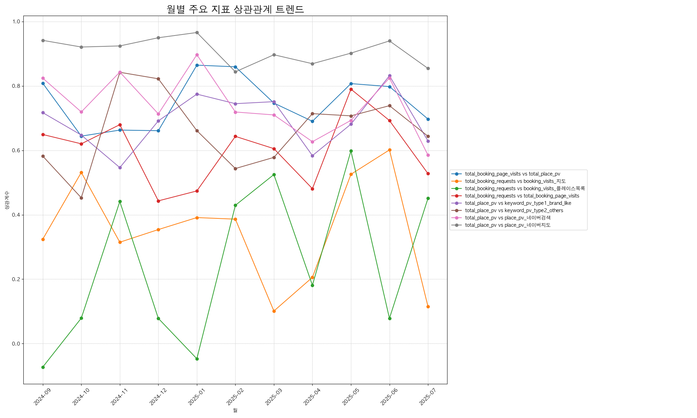

# NATENCLINIC 마케팅 퍼널 상관관계 분석 리포트

## 1. 전체 기간 주요 퍼널 단계별 상관관계

전체 분석 기간동안의 평균적인 관계입니다.

| pair                                                | category       |   correlation |
|:----------------------------------------------------|:---------------|--------------:|
| total_booking_requests vs total_booking_page_visits | 1. 예약 전환 분석    |      0.619793 |
| total_booking_requests vs booking_visits_지도         | 1. 예약 전환 분석    |      0.132434 |
| total_booking_requests vs booking_visits_플레이스목록     | 1. 예약 전환 분석    |      0.140289 |
| total_booking_page_visits vs total_place_pv         | 1. 예약 전환 분석    |      0.190226 |
| total_place_pv vs place_pv_네이버검색                    | 2. 플레이스 트래픽 분석 |      0.870995 |
| total_place_pv vs place_pv_네이버지도                    | 2. 플레이스 트래픽 분석 |      0.958308 |
| total_place_pv vs keyword_pv_type1_brand_like       | 2. 플레이스 트래픽 분석 |      0.79686  |
| total_place_pv vs keyword_pv_type2_others           | 2. 플레이스 트래픽 분석 |      0.712549 |

## 2. 상관관계 안정성 분석 (변동성 낮은 순)

월별 상관관계의 표준편차입니다. 값이 낮을수록 기간에 상관없이 꾸준하고 안정적인 관계임을 의미합니다.

| pair                                                |   std_dev |
|:----------------------------------------------------|----------:|
| total_place_pv vs place_pv_네이버지도                    | 0.0403522 |
| total_booking_page_visits vs total_place_pv         | 0.081933  |
| total_place_pv vs keyword_pv_type1_brand_like       | 0.084995  |
| total_place_pv vs place_pv_네이버검색                    | 0.0953881 |
| total_booking_requests vs total_booking_page_visits | 0.107552  |
| total_place_pv vs keyword_pv_type2_others           | 0.118521  |
| total_booking_requests vs booking_visits_지도         | 0.164302  |
| total_booking_requests vs booking_visits_플레이스목록     | 0.24328   |

## 3. 월별 상관관계 트렌드

주요 관계들이 월별로 어떻게 변하는지 보여줍니다. 특정 마케팅 활동이나 이벤트와의 연관성을 파악하는 데 유용합니다.

## 4. 월별 상관관계 상세 데이터

| month   | category       | pair                                                |   correlation |
|:--------|:---------------|:----------------------------------------------------|--------------:|
| 2024-09 | 1. 예약 전환 분석    | total_booking_requests vs total_booking_page_visits |     0.649323  |
| 2024-09 | 1. 예약 전환 분석    | total_booking_requests vs booking_visits_지도         |     0.324291  |
| 2024-09 | 1. 예약 전환 분석    | total_booking_requests vs booking_visits_플레이스목록     |    -0.0728288 |
| 2024-09 | 1. 예약 전환 분석    | total_booking_page_visits vs total_place_pv         |     0.808413  |
| 2024-09 | 2. 플레이스 트래픽 분석 | total_place_pv vs place_pv_네이버검색                    |     0.824346  |
| 2024-09 | 2. 플레이스 트래픽 분석 | total_place_pv vs place_pv_네이버지도                    |     0.941696  |
| 2024-09 | 2. 플레이스 트래픽 분석 | total_place_pv vs keyword_pv_type1_brand_like       |     0.717093  |
| 2024-09 | 2. 플레이스 트래픽 분석 | total_place_pv vs keyword_pv_type2_others           |     0.582154  |
| 2024-10 | 1. 예약 전환 분석    | total_booking_requests vs total_booking_page_visits |     0.620409  |
| 2024-10 | 1. 예약 전환 분석    | total_booking_requests vs booking_visits_지도         |     0.53151   |
| 2024-10 | 1. 예약 전환 분석    | total_booking_requests vs booking_visits_플레이스목록     |     0.0789712 |
| 2024-10 | 1. 예약 전환 분석    | total_booking_page_visits vs total_place_pv         |     0.644337  |
| 2024-10 | 2. 플레이스 트래픽 분석 | total_place_pv vs place_pv_네이버검색                    |     0.719381  |
| 2024-10 | 2. 플레이스 트래픽 분석 | total_place_pv vs place_pv_네이버지도                    |     0.921016  |
| 2024-10 | 2. 플레이스 트래픽 분석 | total_place_pv vs keyword_pv_type1_brand_like       |     0.647571  |
| 2024-10 | 2. 플레이스 트래픽 분석 | total_place_pv vs keyword_pv_type2_others           |     0.452762  |
| 2024-11 | 1. 예약 전환 분석    | total_booking_requests vs total_booking_page_visits |     0.67987   |
| 2024-11 | 1. 예약 전환 분석    | total_booking_requests vs booking_visits_지도         |     0.314788  |
| 2024-11 | 1. 예약 전환 분석    | total_booking_requests vs booking_visits_플레이스목록     |     0.441253  |
| 2024-11 | 1. 예약 전환 분석    | total_booking_page_visits vs total_place_pv         |     0.66304   |
| 2024-11 | 2. 플레이스 트래픽 분석 | total_place_pv vs place_pv_네이버검색                    |     0.843207  |
| 2024-11 | 2. 플레이스 트래픽 분석 | total_place_pv vs place_pv_네이버지도                    |     0.924405  |
| 2024-11 | 2. 플레이스 트래픽 분석 | total_place_pv vs keyword_pv_type1_brand_like       |     0.546603  |
| 2024-11 | 2. 플레이스 트래픽 분석 | total_place_pv vs keyword_pv_type2_others           |     0.842544  |
| 2024-12 | 1. 예약 전환 분석    | total_booking_requests vs total_booking_page_visits |     0.44323   |
| 2024-12 | 1. 예약 전환 분석    | total_booking_requests vs booking_visits_지도         |     0.354085  |
| 2024-12 | 1. 예약 전환 분석    | total_booking_requests vs booking_visits_플레이스목록     |     0.0782255 |
| 2024-12 | 1. 예약 전환 분석    | total_booking_page_visits vs total_place_pv         |     0.661147  |
| 2024-12 | 2. 플레이스 트래픽 분석 | total_place_pv vs place_pv_네이버검색                    |     0.713378  |
| 2024-12 | 2. 플레이스 트래픽 분석 | total_place_pv vs place_pv_네이버지도                    |     0.949826  |
| 2024-12 | 2. 플레이스 트래픽 분석 | total_place_pv vs keyword_pv_type1_brand_like       |     0.691575  |
| 2024-12 | 2. 플레이스 트래픽 분석 | total_place_pv vs keyword_pv_type2_others           |     0.822334  |
| 2025-01 | 1. 예약 전환 분석    | total_booking_requests vs total_booking_page_visits |     0.474027  |
| 2025-01 | 1. 예약 전환 분석    | total_booking_requests vs booking_visits_지도         |     0.391325  |
| 2025-01 | 1. 예약 전환 분석    | total_booking_requests vs booking_visits_플레이스목록     |    -0.0470885 |
| 2025-01 | 1. 예약 전환 분석    | total_booking_page_visits vs total_place_pv         |     0.864667  |
| 2025-01 | 2. 플레이스 트래픽 분석 | total_place_pv vs place_pv_네이버검색                    |     0.89706   |
| 2025-01 | 2. 플레이스 트래픽 분석 | total_place_pv vs place_pv_네이버지도                    |     0.966038  |
| 2025-01 | 2. 플레이스 트래픽 분석 | total_place_pv vs keyword_pv_type1_brand_like       |     0.774707  |
| 2025-01 | 2. 플레이스 트래픽 분석 | total_place_pv vs keyword_pv_type2_others           |     0.661276  |
| 2025-02 | 1. 예약 전환 분석    | total_booking_requests vs total_booking_page_visits |     0.643509  |
| 2025-02 | 1. 예약 전환 분석    | total_booking_requests vs booking_visits_지도         |     0.386422  |
| 2025-02 | 1. 예약 전환 분석    | total_booking_requests vs booking_visits_플레이스목록     |     0.42939   |
| 2025-02 | 1. 예약 전환 분석    | total_booking_page_visits vs total_place_pv         |     0.859588  |
| 2025-02 | 2. 플레이스 트래픽 분석 | total_place_pv vs place_pv_네이버검색                    |     0.719187  |
| 2025-02 | 2. 플레이스 트래픽 분석 | total_place_pv vs place_pv_네이버지도                    |     0.844004  |
| 2025-02 | 2. 플레이스 트래픽 분석 | total_place_pv vs keyword_pv_type1_brand_like       |     0.745069  |
| 2025-02 | 2. 플레이스 트래픽 분석 | total_place_pv vs keyword_pv_type2_others           |     0.543631  |
| 2025-03 | 1. 예약 전환 분석    | total_booking_requests vs total_booking_page_visits |     0.605412  |
| 2025-03 | 1. 예약 전환 분석    | total_booking_requests vs booking_visits_지도         |     0.101162  |
| 2025-03 | 1. 예약 전환 분석    | total_booking_requests vs booking_visits_플레이스목록     |     0.524976  |
| 2025-03 | 1. 예약 전환 분석    | total_booking_page_visits vs total_place_pv         |     0.746917  |
| 2025-03 | 2. 플레이스 트래픽 분석 | total_place_pv vs place_pv_네이버검색                    |     0.710131  |
| 2025-03 | 2. 플레이스 트래픽 분석 | total_place_pv vs place_pv_네이버지도                    |     0.896979  |
| 2025-03 | 2. 플레이스 트래픽 분석 | total_place_pv vs keyword_pv_type1_brand_like       |     0.75132   |
| 2025-03 | 2. 플레이스 트래픽 분석 | total_place_pv vs keyword_pv_type2_others           |     0.578261  |
| 2025-04 | 1. 예약 전환 분석    | total_booking_requests vs total_booking_page_visits |     0.481125  |
| 2025-04 | 1. 예약 전환 분석    | total_booking_requests vs booking_visits_지도         |     0.205664  |
| 2025-04 | 1. 예약 전환 분석    | total_booking_requests vs booking_visits_플레이스목록     |     0.181089  |
| 2025-04 | 1. 예약 전환 분석    | total_booking_page_visits vs total_place_pv         |     0.690339  |
| 2025-04 | 2. 플레이스 트래픽 분석 | total_place_pv vs place_pv_네이버검색                    |     0.626961  |
| 2025-04 | 2. 플레이스 트래픽 분석 | total_place_pv vs place_pv_네이버지도                    |     0.869194  |
| 2025-04 | 2. 플레이스 트래픽 분석 | total_place_pv vs keyword_pv_type1_brand_like       |     0.583637  |
| 2025-04 | 2. 플레이스 트래픽 분석 | total_place_pv vs keyword_pv_type2_others           |     0.714115  |
| 2025-05 | 1. 예약 전환 분석    | total_booking_requests vs total_booking_page_visits |     0.790151  |
| 2025-05 | 1. 예약 전환 분석    | total_booking_requests vs booking_visits_지도         |     0.525739  |
| 2025-05 | 1. 예약 전환 분석    | total_booking_requests vs booking_visits_플레이스목록     |     0.598607  |
| 2025-05 | 1. 예약 전환 분석    | total_booking_page_visits vs total_place_pv         |     0.807362  |
| 2025-05 | 2. 플레이스 트래픽 분석 | total_place_pv vs place_pv_네이버검색                    |     0.693226  |
| 2025-05 | 2. 플레이스 트래픽 분석 | total_place_pv vs place_pv_네이버지도                    |     0.902005  |
| 2025-05 | 2. 플레이스 트래픽 분석 | total_place_pv vs keyword_pv_type1_brand_like       |     0.681387  |
| 2025-05 | 2. 플레이스 트래픽 분석 | total_place_pv vs keyword_pv_type2_others           |     0.707246  |
| 2025-06 | 1. 예약 전환 분석    | total_booking_requests vs total_booking_page_visits |     0.69272   |
| 2025-06 | 1. 예약 전환 분석    | total_booking_requests vs booking_visits_지도         |     0.601468  |
| 2025-06 | 1. 예약 전환 분석    | total_booking_requests vs booking_visits_플레이스목록     |     0.0782155 |
| 2025-06 | 1. 예약 전환 분석    | total_booking_page_visits vs total_place_pv         |     0.798116  |
| 2025-06 | 2. 플레이스 트래픽 분석 | total_place_pv vs place_pv_네이버검색                    |     0.824736  |
| 2025-06 | 2. 플레이스 트래픽 분석 | total_place_pv vs place_pv_네이버지도                    |     0.94001   |
| 2025-06 | 2. 플레이스 트래픽 분석 | total_place_pv vs keyword_pv_type1_brand_like       |     0.831833  |
| 2025-06 | 2. 플레이스 트래픽 분석 | total_place_pv vs keyword_pv_type2_others           |     0.738813  |
| 2025-07 | 1. 예약 전환 분석    | total_booking_requests vs total_booking_page_visits |     0.527904  |
| 2025-07 | 1. 예약 전환 분석    | total_booking_requests vs booking_visits_지도         |     0.115098  |
| 2025-07 | 1. 예약 전환 분석    | total_booking_requests vs booking_visits_플레이스목록     |     0.451152  |
| 2025-07 | 1. 예약 전환 분석    | total_booking_page_visits vs total_place_pv         |     0.697359  |
| 2025-07 | 2. 플레이스 트래픽 분석 | total_place_pv vs place_pv_네이버검색                    |     0.58516   |
| 2025-07 | 2. 플레이스 트래픽 분석 | total_place_pv vs place_pv_네이버지도                    |     0.854606  |
| 2025-07 | 2. 플레이스 트래픽 분석 | total_place_pv vs keyword_pv_type1_brand_like       |     0.629339  |
| 2025-07 | 2. 플레이스 트래픽 분석 | total_place_pv vs keyword_pv_type2_others           |     0.643873  |
